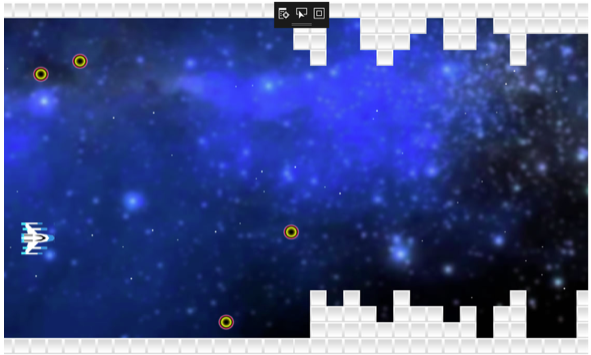

## Sprites for Islandwood

#Using the [Windows Bridge for IOS](https://github.com/Microsoft/WinObjC/releases) to write a sprite-based game for Windows 10

**Introduction**

Who doesn’t like a good, old-fashioned 2D arcade game? Games have always been one of the best ways to get into programming, and also one of the best ways for trying out new platforms and technologies. Case in point: in this tutorial, we’ll look at how a sprite-based game written for iOS can be converted to become a Windows UWP app. 

Sprites are simply shapes that can be quickly drawn on the screen. They’re ideal for drawing spaceships, aliens, laser blasts, plumbers, gorillas – you name it. If you ever developed Windows games using the XNA library, you’ll know all about them.

iOS comes with the UISpriteKit framework, but as the iOS Bridge doesn’t currently support that, we’ll use GLKit to write our own basic sprite routine. This sprite class will be as simple as it can get, but it will be a good starting point for your own code, and will let you create all manner of 2D games. 

**Getting Started**

For this tutorial, you will need:

A PC running Windows 10, with [Visual Studio 2015](https://dev.windows.com/en-us/downloads) and the [Windows Bridge for IOS](https://github.com/Microsoft/WinObjC/releases) installed. If you don’t have a PC, a virtual PC can be used instead. There are images you can download [here](https://dev.windows.com/bridges/ios).
A Mac running macOS 10.11 and Xcode 7, or better.
A copy of the iOS project source code.

**The iOS app**

Download this iOS project, and load it into Xcode. You can launch it on the emulator or deploy it to a connected iPad (if you enter your Apple Developer account details). Once it’s running, swipe the screen up and down to move your ship, and tap to shoot a laser blast. If your ship is hit, it explodes and will re-appear in a few seconds. That’s all there is to the gameplay.

The app uses GLKit to set up an OpenGL view (in AppDelegate.m), and then defines a customer rendered class (Renderer.m) to define an OpenGL display projection, and handle the refresh code that is called 60 times a second. This is all boilerplate stuff that will appear in any GLKit app.

Renderer.m is also where our sprites are instantiated, using the SpriteClass.m object. This is the code you’ll be interested in, as it is responsible for setting up the textures (loading them from .png) files, and drawing them every frame with the glDrawArrays() method. If you haven’t used much OpenGL before, this can appear like complete gibberish, but the good news is that you don’t need to touch it once you have it working. 

Here’s the method that does the rendering of the sprite: it essentially uses two triangle primitives to create a square, and then applies a texture. GLKit is kind enough to respect the transparency in a PNG image, which makes for much nicer effect.

~~~~
- (void)render {
    
    if (_hidden) return;
    
    _beffect.texture2d0.name = _textureInfo.name;
    _beffect.texture2d0.enabled = YES;
    _beffect.transform.modelviewMatrix = self.modelMatrix;
    
    [_beffect prepareToDraw];
    
    
    glEnableVertexAttribArray(GLKVertexAttribPosition);
    glEnableVertexAttribArray(GLKVertexAttribTexCoord0);
    
    GLfloat squareVertices[] = {
        0, 0,
        _spriteSize.width, 0,
        0, _spriteSize.height,
        _spriteSize.width, _spriteSize.height
    };
    
    GLfloat squareTexture[] = {
        0, 0,
        1, 0,
        0, 1,
        1, 1
    };
    
    glVertexAttribPointer(GLKVertexAttribPosition, 2, GL_FLOAT, GL_FALSE, 0, squareVertices);
    glVertexAttribPointer(GLKVertexAttribTexCoord0, 2, GL_FLOAT, GL_FALSE, 0, squareTexture );
    
    
    glDrawArrays(GL_TRIANGLE_STRIP, 0, 4);
    
}
~~~~

Seven different sprite types are defined:

1. The player’s ship
2. The bad guy aliens
3. Laser blasts
4. Stars for the parallax starfield
5. Background texture
6. Explosions 
7. Blocks for the scrolling landscape

All of them are based on SpriteClass. To make the bad guy aliens look a little more cool, two sprites are drawn for every bad guy, one with pulsating height and the other with pulsating width. This makes them almost look like they are spinning. Similarly, the explosion is created by zooming an image of an explosion over a few frames before it vanishes.

And as for collision detection? Sorry, there is nothing subtle going on here. There is no pixel-by-pixel tests happening, only a check for overlapping rectangles. 

To keep things simple, we’re going to support swipe and tap events to move the player’s ship, and trigger firing a laser.

**Using the iOS Bridge**

Now we get to the stage where we can convert the Xcode app to a Visual Studio solution.
Make sure you have the latest Windows Bridge for iOS tools installed on your (real or virtual PC). Copy the correct bits from the github location [here](https://github.com/Microsoft/WinObjC/releases). 

*Remember: click on the Release link, do not clone the repo directly.*

Copy the SpriteSample Xcode project to the PC. You can then you can simply drag-and-drop the vsimporter.bin command right into the folder containing your Xcode project.

You can now double-click on the newly created SpriteSample-WinStore10.sln file, and the solution will open in Visual Studio. 

Before you run it though, you need to make two changes.

Add the following code to the AppDelegate.m file, immediately after the first #import statement. This make sure the app opens with the correct size and scaling.

~~~~
#import "AppDelegate.h"

#ifdef WINOBJ

@implementation UIApplication (UIApplicationInitialStartupMode)

// Let WindObj know how to render the app

(void) setStartupDisplayMode:(WOCDisplayMode *)mode
{
   mode.autoMagnification = TRUE;
   mode.sizeUIWindowToFit = TRUE;
   mode.fixedWidth = 0;
   mode.fixedHeight = 0;
   mode.magnification = 1.0;
}
 
@end
#endif
~~~~

Check the Visual Studio solution for a folder called Base under the SpriteSample folder containing some Storyboard files. As this app doesn’t use Storyboards, their presence can cause issues, so delete Base and the files it contains.

Now you should be able to press F5, and build and run the app right on your local Windows device.

**Game over - next steps**

This is certainly a simple sample, and it needs a lot more work before it could ever be called a game, but it demonstrates how the Windows Bridge for iOS can be used to convert a GLKit iOS app to the UWP platform, and provide a quick and dirty way of getting sprites working on Windows. Hopefully you can use to create some fun Windows shoot-em-ups!
